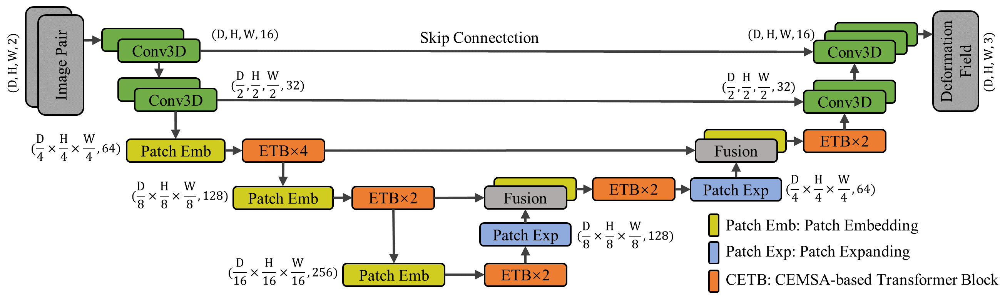

# SymTrans: Symmetric Transformer-based model for image registration

## Paper:

 **Symmetric Transformer-based Network for Unsupervised Image Registration**

Please cite: https://arxiv.org/abs/2204.13575

The proposed SymTrans architecture：

 
 
The GPU memory occupied during training is about 3 GB with a batch size of 1 on our server. Vit-V-Net and Transmorph occupy about 6 GB and 7 GB of GPU memory. All the data are size of [96,112,96]. The paramters and FLOPs is following.

| Method     |    Trans. L. | Params (M) | FLOPs (G) |
| ---------- | ------------ | ---------- | --------- |
| VoxelMorph | -            | 0.29       | 59.82     |
| SYMNet     | -            | 1.12       | 44.51     |
| Vit-V-Net  | 1/16         | 31.50      | 65.77     |
| TransMorph | 1/4          | 46.69      | 112.75    | 
| SymTrans   | 1/4          | 16.05      | 63.53     |


## Trained model

We uploaded the weights, including the displacement and diffeomorphic registration model's weights.

## Training

If you would like to train this model on your own dataset, conver you data to `numpy.array` (i.e. `.npy`) format, then put them in `/Data/train_data/`.
To validate the training process, put the validation data in `/Data/validation_data/`. In detail, put the atlases to `/Data/validation_data/atlases/`; put the atlases' labels to `/Data/validation_data/atlases_label/`. Correspondingly, put moving (source) images and their labels in `/Data/validation_data/valsets/` and `/Data/validation_data/valsets_label/`.

Excute this comand train the SymTran after allocate the dataset：

```
python train.py
```
Checkpoints and training logs, including validation results and loss values, are recorded in the`./Chekcpoint/` and './Log/' folder. You can use tensorboardx to moniter the training. Using the parameter `--learning_mode ` to select diffeomorphic or displacement registration (default `--learning_mode displacement`).

All the parameters can be found in the `train.py` and `test.py`. You can modify them if you would like to configure your own training or testing.
